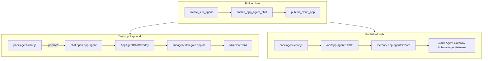

# App Agent Chat — Embedded Sub-Agent in Mini-Apps

**Status:** Phase 1 + Phase 2 implemented (2026-07-18) — config tool, desktop overlay, live SSE chat on web

---

## Problem

Published and desktop mini-apps often need **in-app AI chat**: users stay in the app while an assistant reads/updates files, content, and linked databases. Today that means either opening main Paprwork chat (desktop-only) or fire-and-forget `/api/jobs/run` — not a conversational in-context experience.

| Surface | Today | Target |
|---------|-------|--------|
| Desktop Paprwork | `chat.open` → main chat tab | Bound **sub-agent** panel with app context |
| Published web | No `paprAPI`; jobs only | Floating **bubble + live chat** |
| Builder agent | Manual wiring | `enable_app_agent_chat` tool |

Works for **any** mini-app: dashboards, internal tools, data explorers, content editors, workflow UIs, etc.

---

## Architecture



---

## Phase 1 (shipped)

### 1. `enable_app_agent_chat` tool

Binds a sub-agent profile to a mini-app and optionally injects the SDK script into `index.html`. Also creates/updates a hidden **cloud subagent job** (`agentChatJobId` in `metadata.json`) for published web turns.

```typescript
create_sub_agent({ id: "inventory-assistant", ... })

enable_app_agent_chat({
  appId: "<app-uuid>",
  subAgentId: "inventory-assistant",
  welcomeMessage: "Ask me to update items, filters, or linked data.",
  injectSdk: true,
})
```

**Stored on:** `MiniApp.agentChat` in `$PAPR_HOME/data/apps.json` + public fields in `metadata.json` on publish.

### 2. Desktop UX

- SDK bubble → `paprAPI.invoke('chat.open', { mode: 'app-agent', appId, subAgentId })`
- Paprwork shows `AppAgentChatOverlay` with `MiniChatCard`

### 3. Web UX (Phase 2)

- Same SDK mounts bubble + **live chat panel**
- `POST /api/app-agent/sessions` → create session
- `POST /api/app-agent/sessions/:id/messages` → start turn (returns `turnId`)
- `GET /api/app-agent/sessions/:id/stream?turnId=` → SSE (`text-delta`, `tool-call`, `turn-done`)
- Requires Papr sign-in on share links when agent jobs require auth (existing policy)
- Auto-reloads app when assistant writes files (`shouldRefreshApp`)

### 4. API

| Endpoint | Purpose |
|----------|---------|
| `GET /api/apps/:appId/agent-chat` | Public config (gateway + cloud host) |
| `POST /api/app-agent/sessions` | Create chat session |
| `GET /api/app-agent/sessions/:id` | Load session messages |
| `POST /api/app-agent/sessions/:id/messages` | Send user message, start turn |
| `GET /api/app-agent/sessions/:id/stream?turnId=` | SSE stream for turn |
| `POST /api/app-agent/sessions/:sessionId/warm` | Pre-warm gateway sandbox (bubble open) |
| `GET /api/app-agent/sessions/:sessionId/warm` | Poll warm status |
| `GET /__papr__/papr-agent-chat.js` | Transpiled SDK bundle |

---

## Phase 2 (shipped)

1. **CloudAppHost routes** — session create, message send, SSE stream
2. **Direct user ↔ sub-agent** — no main-agent relay; `delegate_task` / `request_agent_input` blocked in embedded tool allowlist
3. **Tool override** from `agentChat.allowedToolIds` at runtime (desktop)
4. **Session persistence** — file store on desktop (`$PAPR_HOME/data/app-agent-sessions/`); in-memory on cloud host
5. **App refresh** — SDK reloads page when turn completes with file writes

**Cloud execution path (published web bubble):**

1. Cloud App Host → `POST /v1/cloud/apps/runtime/app-agent/stream` on memory server
2. Memory server prepares the synced hidden subagent job (`agentChatJobId`) and proxies **`POST /internal/agent/stream`** on the Cloud Agent Gateway (same backend as cloud agent jobs)
3. Gateway SSE (`text-delta`, `tool-call`, `tool-result`, `done`) is mapped to `app-agent:*` events for the browser bubble

There is **no job-run polling fallback** — if the memory stream endpoint is missing, users see a clear error to republish / upgrade memory-server.

### Pre-warm (intent-based, 2026-07-18)

When the user **opens the chat bubble** (not on page load), the SDK calls `POST .../warm` in parallel with session ensure. Cloud App Host dedupes and forwards to memory → gateway `POST /internal/agent/session/begin`. Goal: clone + Turso pull happen **before** the first message.

See **`docs/APP_AGENT_GATEWAY_WARM_SPEC.md`** for the full memory + gateway contract.

---

## Agent playbook (any app)

1. `create_plan` — define assistant role + bubble UX for this app
2. `create_sub_agent` — specialist with tools matched to the app's files/data
3. Build mini-app UI
4. `enable_app_agent_chat` — bind agent, inject SDK, create cloud job
5. `publish_cloud_app` — sync `subagents.json` + app config + `metadata.json`
6. Test desktop bubble → overlay; test published web bubble → live chat

---

## Files

| File | Role |
|------|------|
| `src/core/types/appAgentChat.ts` | Config + session + SSE types |
| `src/core/tools/appAgentChat.ts` | `enable_app_agent_chat` tool |
| `src/gateway/services/appAgentChat/*` | Session store, runners, routes |
| `src/resources/mini-app-sdk/papr-agent-chat.ts` | Client SDK (live chat) |
| `ui/components/Apps/AppAgentChatOverlay.tsx` | Desktop floating panel |
| `tests/app-agent-chat.test.ts` | Unit tests |

---

## Memory server contract (`app-agent/stream`)

Cloud App Host calls:

`POST /v1/cloud/apps/runtime/app-agent/stream`

**Body:** `namespaceId`, `slug`, `paprApiKey`, `shareToken`, `sessionId`, `appId`, `subAgentId`, `jobId` (hidden `agentChatJobId`), `userMessage`, `prompt`, optional `history[]`

**Memory server should:**

1. Resolve app repo + synced subagent job from `jobId`
2. Build `CloudAgentRunRequest` (same as `job-run` prepare)
3. Set `workspaceSessionId: sessionId` and `keepWorkspaceWarm: true` on the gateway request
4. Proxy `POST {gateway}/internal/agent/stream` with that request
5. Pipe gateway SSE (`data: { type, payload, ... }`) back to Cloud App Host unchanged

### Memory server contract (`app-agent/warm`)

`POST /v1/cloud/apps/runtime/app-agent/warm`

Same auth + prepare as stream. Proxy to gateway:

`POST {gateway}/internal/agent/session/begin` with `workspaceSessionId: sessionId`.

Return `{ status: "ready" | "warming", sessionId, expiresAt? }` to App Host.

Gateway implementation: `src/gateway/services/cloudAgentGateway/cloudAgentSessionCache.ts`

Paprwork maps gateway chunks → `app-agent:*` SSE for the browser SDK. Pre-mapped `app-agent:*` events are also accepted if memory wraps them.

---

## Security

- Sub-agent **tool allowlist** — relay tools blocked in embedded mode
- **App-scoped** `appIds` on cloud subagent job
- Cloud agent runs require auth on share links
- Public API exposes **no** system prompts or internal tool lists

