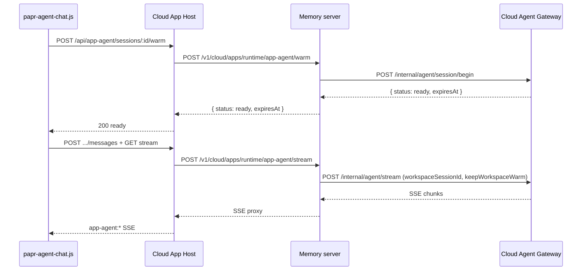

# App-Agent Chat — Gateway Session Warm Spec

**Status:** Gateway implementation in paprwork-v2 (2026-07-18). Memory-server wiring TODO.

---

## Goal

Published web app-agent chat should feel **fast** (Replit-like) without paying a full **git clone + Turso pull** on every message. Pre-warm the gateway workspace when the user opens the chat bubble (intent), reuse it for subsequent turns until idle TTL.

| Stage | Trigger | Cost |
|-------|---------|------|
| 0 | Page load / browse | $0 |
| 1 | `POST /api/app-agent/sessions` | Low (App Host only) |
| 2 | Bubble open → `POST .../warm` | **Clone + Turso pull once** |
| 3 | Each chat turn → `stream` | Turso pull/push only (reuse workspace) |
| 4 | Idle 15m | Workspace deleted |

**Auth:** Same as cloud agent jobs on share links — Papr sign-in required before warm/stream.

---

## Three-layer flow



---

## 1. Cloud App Host (paprwork — shipped)

| Route | Behavior |
|-------|----------|
| `POST /api/app-agent/sessions/:sessionId/warm` | Dedupe via `AppAgentChatWarmCoordinator`, call memory warm |
| `GET /api/app-agent/sessions/:sessionId/warm` | Poll coordinator snapshot |

SDK (`papr-agent-chat.ts`): on panel open → ensure session → `POST warm` → show “Starting assistant…” until ready.

Desktop: warm route marks `ready` immediately (local gateway, no cloud sandbox).

---

## 2. Memory server (TODO)

### `POST /v1/cloud/apps/runtime/app-agent/warm`

**Auth:** Same as existing `app-agent/stream` — namespace, slug, share token, Papr API key, signed-in user when required.

**Body:**

```json
{
  "namespaceId": "...",
  "slug": "my-app",
  "paprApiKey": "sk-org-...",
  "shareToken": "...",
  "sessionId": "uuid-from-app-host",
  "appId": "mini-app-uuid",
  "subAgentId": "profile-id",
  "jobId": "hidden-agentChatJobId"
}
```

**Steps:**

1. ACL check (share link + sign-in policy)
2. `prepare_cloud_agent_run_context` — same as `job-run` / `app-agent/stream` (repo token, Turso creds, vault keys, `CloudAgentRunRequest` fields)
3. Call gateway:

```http
POST {CLOUD_AGENT_GATEWAY}/internal/agent/session/begin
X-Cloud-Agent-Gateway-Key: ...
Content-Type: application/json

{
  "orgId": "...",
  "userId": "...",
  "namespaceId": "...",
  "jobId": "...",
  "workspaceSessionId": "<sessionId from body>",
  "paprApiKey": "...",
  "repoCloneUrl": "...",
  "repoToken": "...",
  "tursoSources": [...],
  "vaultKeys": {...},
  "llmAuth": { "provider": "...", "authType": "...", "token": "..." },
  "allowedToolIds": [...]
}
```

Note: `prompt` is **not** required for begin. `runId` optional — gateway uses `workspaceSessionId` for disk path.

4. **Response to App Host:**

```json
{
  "status": "ready",
  "sessionId": "...",
  "expiresAt": "2026-07-18T20:45:00.000Z"
}
```

Or `202` + `{ "status": "warming" }` if begin is async (gateway currently returns ready when clone finishes).

**404:** Route not deployed — App Host maps to `unavailable` (graceful; first message may cold-start).

---

### `POST /v1/cloud/apps/runtime/app-agent/stream`

**Existing contract** — add gateway fields on prepare:

```json
{
  "...existing fields...",
  "workspaceSessionId": "<same sessionId>",
  "keepWorkspaceWarm": true,
  "runId": "<new uuid per turn>"
}
```

Proxy to `POST /internal/agent/stream` with those fields. Pipe SSE back unchanged.

**Per-turn `runId`:** New id each message (isolated turn bookkeeping). **`workspaceSessionId`** must stay stable for workspace reuse.

**History:** App Host still sends `history[]` in prompt; LLM `chatId` remains `job:{jobId}:{runId}` per turn.

---

## 3. Cloud Agent Gateway (paprwork — implementing)

### Session disk layout

```
/tmp/papr-cloud-session/{workspaceSessionId}/Papr/   ← cloned repo
/tmp/papr-cloud-run/{runId}/Papr/                  ← one-shot jobs (unchanged)
```

### New endpoints

| Endpoint | Purpose |
|----------|---------|
| `POST /internal/agent/session/begin` | Clone once (if missing), Turso pull, cache 15m TTL |
| `DELETE /internal/agent/session/:sessionId` | Force teardown |

### Modified

| Endpoint | Change |
|----------|--------|
| `POST /internal/agent/stream` | If `workspaceSessionId` + `keepWorkspaceWarm`: reuse cached workspace; after turn push Turso, restore env, **keep disk** |

### Request fields (`CloudAgentRunRequest`)

```typescript
workspaceSessionId?: string;  // app-agent chat session id
keepWorkspaceWarm?: boolean;  // default false; true for app-agent turns
```

### Response (`POST /internal/agent/session/begin`)

```json
{
  "status": "ready",
  "sessionId": "workspaceSessionId",
  "expiresAt": "ISO-8601"
}
```

### Cache behavior

- **TTL:** 15 minutes idle (matches `AppAgentChatWarmCoordinator`)
- **Dedupe:** Concurrent `begin` for same `sessionId` → single clone
- **Max sessions:** 50 per instance (LRU evict oldest)
- **Turn lock:** One active turn per session (second stream waits on mutex)
- **Cloud Run:** Cache is per-instance; warm is best-effort after scale-to-zero

### Security

- Memory server only — gateway key required; browser never calls gateway
- Same user/org validation on memory before begin/stream
- Do **not** reuse workspace across different `userId` / `jobId` — memory must pass consistent prepare context; gateway evicts cache entry if `jobId` or `userId` mismatch

---

## 4. Rollout order

1. **Deploy gateway** with session cache + `/internal/agent/session/begin` ✅ (paprwork-v2)
2. **Memory:** implement `/app-agent/warm` → gateway begin ✅ (`memory` repo)
3. **Memory:** pass `workspaceSessionId` + `keepWorkspaceWarm` on stream ✅ (`memory` repo)
4. **Verify:** bubble open → warm ready → first message <5s; second message faster (no clone in logs)

---

## 5. Local verification (gateway only)

```bash
# Terminal 1 — gateway
GATEWAY_MODE=cloud_agent npm run start:cloud-agent-gateway

# Terminal 2 — begin session (requires real repo token + job in prepare payload)
curl -X POST http://localhost:8788/internal/agent/session/begin \
  -H "X-Cloud-Agent-Gateway-Key: $PAPR_CLOUD_AGENT_GATEWAY_KEY" \
  -H "Content-Type: application/json" \
  -d '{ "workspaceSessionId": "test-session-1", "orgId": "...", ... }'

# Second begin should log cache hit (skip clone)
```

---

## Related docs

- `docs/APP_AGENT_CHAT.md` — feature overview + warm routes
- `docs/CLOUD_AGENT_GATEWAY_PLAN.md` — gateway architecture
- `src/gateway/services/cloudAgentGateway/cloudAgentSessionCache.ts` — implementation
