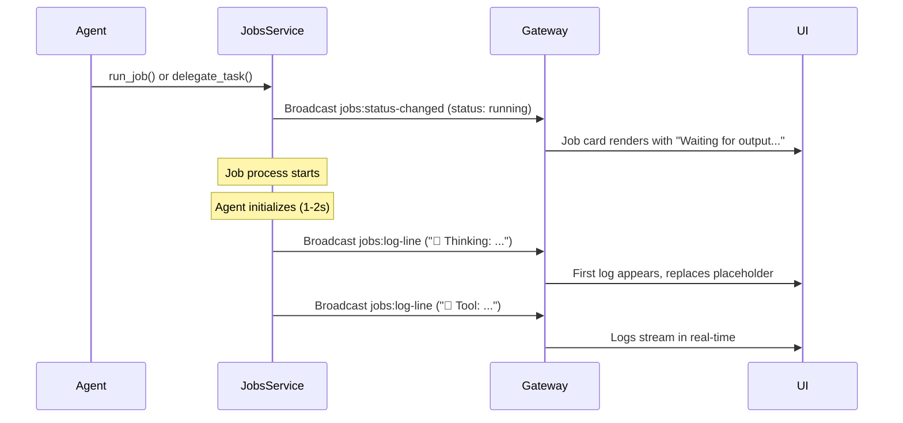

# Job Status Card "Waiting for output..." Behavior

**Date:** 2026-02-20

## Question

Why does a job card show "Waiting for output..." instead of logs?

## Answer

This is **correct behavior** when:
1. Job status is "running"
2. No log lines have been received yet from the `jobs:log-line` broadcast

### When You'll See This

**Scenario 1: Agent Job Just Started**
```
Agent calls delegate_task or run_job
→ Job created and starts executing
→ Card shows "Waiting for output..." (0-2 seconds)
→ First log line arrives (agent thinking, tool call, etc.)
→ Logs appear in card
```

**Scenario 2: Command Job (Python/Node/Bash)**
```
Job starts
→ Script initializing
→ Card shows "Waiting for output..." (0-5 seconds)
→ First print/echo statement executes
→ Logs appear in card
```

**Scenario 3: Slow Initialization**
```
Job with heavy imports or setup
→ Card shows "Waiting for output..." (up to 10 seconds)
→ Logs start streaming after initialization
```

### The Flow



### What the Placeholder Looks Like

```
┌─────────────────────────────────────┐
│ ⏳ Job Name              [Running]  │
├─────────────────────────────────────┤
│                                     │
│   ⚫ Waiting for output...          │
│                                     │
└─────────────────────────────────────┘
```

### What It Looks Like After Logs Arrive

```
┌─────────────────────────────────────┐
│ ⏳ Job Name              [Running]  │
├─────────────────────────────────────┤
│ 💭 Thinking: I'll search for...    │
│ 🔧 Tool: web_search({"query": ... │
│ ✅ Result: Found 10 articles...    │
│ 💭 Thinking: Now let me analyze... │
│                                     │
│ View logs →                         │
└─────────────────────────────────────┘
```

## Why This Design?

### 1. User Feedback
- Shows the job is running (not stuck)
- Animated dot indicates activity
- Better UX than empty box

### 2. Handles Initialization Delay
- Agent jobs take 1-2s to initialize
- LLM API calls have latency
- Script imports can take time
- Placeholder prevents confusion

### 3. Graceful Degradation
- If job produces no output, placeholder stays visible
- User knows job is running but silent
- Better than showing nothing

## Delegation Card Live Logs

Yes! Delegation cards also show live logs:

```typescript
// DelegationCard.tsx (lines 28-30)
const liveLogs = useJobLiveLogsStore((s) =>
  data.status === "running" ? (s.logsByJobId.get(data.id) ?? []) : [],
);
```

### What You'll See in Delegation Cards

```
┌─────────────────────────────────────────────┐
│ 🤖 Research Agent: Find top res... [Running]│
├─────────────────────────────────────────────┤
│ Sub-agent Activity                          │
│ ─────────────────                           │
│ 💭 Thinking: I'll search for restaurants... │
│ 🔧 Tool: web_search({"query": "foster..."  │
│ ✅ Result: Found 15 restaurants...          │
│ 💭 Thinking: Let me filter for halal...     │
│ 🔧 Tool: bash({"command": "curl..."        │
│ ✅ Result: {"data": [...]}                  │
└─────────────────────────────────────────────┘
```

## Common Scenarios

### Scenario 1: Fast Job (< 1 second)
User might not even see "Waiting for output..." - logs appear immediately.

### Scenario 2: Normal Job (1-3 seconds)
"Waiting for output..." visible briefly, then replaced with logs.

### Scenario 3: Slow Job (5+ seconds)
"Waiting for output..." visible longer. This is OK - shows job is running.

### Scenario 4: Silent Job
Job runs but produces no output. Placeholder stays visible. This is rare but valid.

### Scenario 5: Stuck Job
Job hangs during initialization. Placeholder stays visible indefinitely. User can cancel or check logs.

## Troubleshooting

### If "Waiting for output..." Never Goes Away

**Check 1: Is the job actually running?**
```bash
# Look in terminal for job execution
grep "Starting isolated agent run\|Starting job" terminals/2.txt
```

**Check 2: Are logs being broadcast?**
```bash
# Look for log broadcasts
grep "jobs:log-line" terminals/2.txt
```

**Check 3: Is the job stuck?**
```bash
# Check for errors
grep "error\|Error\|ERROR" terminals/2.txt | grep <job-id>
```

**Check 4: Is the WebSocket connected?**
```javascript
// In browser console
console.log('WebSocket connected:', !!window.gateway);
```

### If Delegation Card Shows No Logs

**Check 1: Is the sub-agent job running?**
The delegation creates a job with `type: "subagent"`. Check if that job is running.

**Check 2: Is structured logging enabled?**
We just added this! Make sure the code is reloaded.

**Check 3: Is the job ID correct?**
Delegation card uses `data.id` to lookup logs. Verify this is the correct job ID.

## Related Code

### JobStatusCard
- **File:** `ui/components/Chat/JobStatusCard.tsx`
- **Lines:** 202-233 (logs rendering)
- **Lines:** 34-36 (live logs subscription)

### DelegationCard  
- **File:** `ui/components/Chat/DelegationCard.tsx`
- **Lines:** 28-30 (live logs subscription)
- **Lines:** 142-158 (logs rendering)

### Job Live Logs Store
- **File:** `ui/stores/jobLiveLogsStore.ts`
- **Lines:** 68-71 (log broadcast listener)

### Structured Logging
- **File:** `src/gateway/services/AgentService.ts`
- **Lines:** 1317-1350 (agent job structured logging)

## Summary

**"Waiting for output..." is normal and expected** for the first 1-5 seconds of a job execution. It indicates:
- ✅ Job is running
- ✅ UI is responsive
- ⏳ Waiting for first log line to arrive

Once the agent starts working, you'll see:
- 💭 Thinking steps
- 🔧 Tool calls
- ✅ Tool results
- ❌ Errors (if any)

**This applies to both:**
- Regular job cards (`JobStatusCard`)
- Delegation cards (`DelegationCard`)

Both show real-time logs as the job executes!
