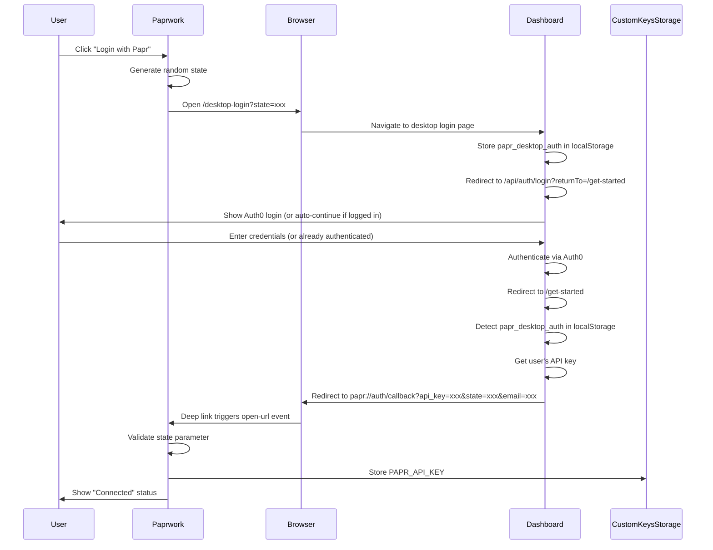

# Papr Login Integration - Automatic API Key Provisioning

**Implementation Date:** 2026-03-28  
**Status:** ✅ Complete

## Overview

Users can now log in to their Papr account directly from Paprwork V2 to automatically receive an API key for memory and cloud features. This eliminates the manual copy-paste flow and provides a seamless onboarding experience.

## Architecture

### Components

1. **UI Component** (`ui/components/Settings/PaprLoginSection.tsx`)
   - Login/logout UI
   - Status display (logged in/logged out)
   - Error handling

2. **IPC Handler** (`src/electron/ipc/paprLogin.ts`)
   - Opens dashboard with `/desktop-login` page
   - Generates random state for CSRF protection
   - Handles deep link callback from dashboard (`papr://auth/callback`)
   - Validates state parameter
   - Stores API key in CustomKeysStorage

3. **Deep Link Handler** (`src/electron/index.cjs`)
   - Registers `papr://` custom URL protocol
   - Listens for `open-url` events (macOS)
   - Handles command-line arguments (Windows/Linux)

4. **Type Definitions** (`ui/types/electron.d.ts`)
   - `window.electronAPI.papr.checkLoginStatus()`
   - `window.electronAPI.papr.startLogin()`
   - `window.electronAPI.papr.logout()`

5. **Integration Points**
   - Settings → API Keys tab (top of page)
   - Onboarding → Pre-step before "Connect accounts"

### Deep Link OAuth Flow



This leverages the **existing desktop auth flow** already built into the dashboard (see `apps/web/app/(protected)/get-started/page.tsx` lines 30-72).

### API Key Format

The dashboard provides existing API keys in this format:

```
sk-org-{organizationId}-namespace-{namespaceId}-{32-char-random}
```

Example:
```
f1927a15••••••••••••••••••••••••••••
```

The dashboard automatically retrieves the user's existing API key and sends it via deep link - no manual key generation needed in Paprwork.

## User Experience

### First-Time Users

1. User downloads and launches Paprwork
2. Onboarding screen shows "Login to Papr" section (marked as "Recommended")
3. User clicks "Login with Papr"
4. Browser opens to `dashboard.papr.ai/desktop-login?state=xxx`
5. Desktop login page stores state in localStorage and redirects to Auth0 with `returnTo=/get-started`
6. User authenticates via Auth0 (or auto-continues if already authenticated)
7. Auth0 redirects to `/get-started` page
8. Dashboard detects `papr_desktop_auth` flag in localStorage
9. Dashboard retrieves user's API key
10. Dashboard redirects to `papr://auth/callback?api_key=xxx&state=xxx&email=xxx`
11. Paprwork catches the deep link
12. Paprwork validates state parameter (CSRF protection)
13. Paprwork stores API key in macOS Keychain
13. Paprwork shows "Connected to Papr" with user email
14. User continues with remaining onboarding steps

### Existing Users

1. Open Settings → API Keys tab
2. See "Login to Papr" section at top
3. Click "Login with Papr"
4. Follow same deep link OAuth flow
5. API key automatically replaces any existing PAPR_API_KEY

### Logout

1. Click "Logout" button in Settings or Onboarding
2. PAPR_API_KEY removed from CustomKeysStorage
3. UI shows login option again

## Environment Variables

### Required for Production

```bash
# Papr dashboard URL (default: https://dashboard.papr.ai)
PAPR_PLATFORM_URL=https://dashboard.papr.ai
```

### Development

```bash
# Use local dashboard for testing
PAPR_PLATFORM_URL=http://localhost:3000
```

**Note:** GraphQL URL is no longer needed - the dashboard handles all API key retrieval via its existing deep link flow.

## Implementation Details

### Security

1. **State Parameter** - Random 32-char string for CSRF protection, validated on callback
2. **API Key Storage** - Stored in system keychain via CustomKeysStorage (macOS Keychain, Windows Credential Manager, Linux Secret Service)
3. **Deep Link Protocol** - Custom `papr://` protocol registered with OS, only accessible to Paprwork
4. **Timeout** - Desktop auth data expires after 10 minutes (dashboard's built-in protection)

### Deep Link Registration

Paprwork registers as the handler for `papr://` URLs:
- **macOS**: Handled via `open-url` event
- **Windows**: Handled via command-line arguments when app launches
- **Linux**: Handled via command-line arguments when app launches

### Error Handling

- **State mismatch** - Shows CSRF error, requires retry
- **No API key in callback** - Shows error, allows retry
- **Storage failed** - Shows keychain error, allows retry
- **Dashboard timeout** - Desktop auth expires after 10 minutes

### Dashboard Integration

The dashboard already has desktop auth support (see `apps/web/app/(protected)/get-started/page.tsx`):
- Detects `desktop_auth=true` in URL parameters
- Stores auth intent in localStorage
- After Auth0 login, redirects to `/get-started`
- Checks for `papr_desktop_auth` in localStorage
- If found, builds deep link: `papr://auth/callback?api_key=xxx&state=xxx&email=xxx&user_id=xxx`
- Redirects browser to deep link
- Paprwork catches it and completes the flow

## Files Changed

### Created

- `ui/components/Settings/PaprLoginSection.tsx` - Login UI component
- `ui/components/Settings/PaprLoginSection.css` - Styles
- `src/electron/ipc/paprLogin.ts` - IPC handlers and OAuth logic
- `docs/PAPR_LOGIN_INTEGRATION.md` - This file

### Modified

- `src/electron/index.cjs` - Initialize Papr login IPC handlers
- `ui/types/electron.d.ts` - Add `papr` API namespace
- `ui/components/Settings/SettingsView.tsx` - Add PaprLoginSection to API Keys tab
- `ui/components/Onboarding/OnboardingView.tsx` - Add Papr login section
- `ui/components/Onboarding/OnboardingView.css` - Add Papr section styles

## Testing

### Manual Testing Checklist

- [ ] First-time user can log in and receive API key via deep link
- [ ] API key appears in Settings → API Keys
- [ ] Logout removes API key from settings
- [ ] Re-login replaces existing API key
- [ ] State validation works (CSRF protection)
- [ ] Deep link works when app is already running
- [ ] Deep link works when app is launched from URL
- [ ] Error handling works for invalid state
- [ ] Onboarding marks step 1 complete after login
- [ ] Settings section shows logged-in state with email

### Integration Testing

1. **New User Onboarding**
   ```bash
   # 1. Clear all settings
   rm -rf ~/.paprwork-v2
   
   # 2. Start app
   npm start
   
   # 3. Click through onboarding
   # 4. Login with Papr
   # 5. Verify API key added
   # 6. Complete remaining steps
   ```

2. **Existing User Login**
   ```bash
   # 1. Open Settings
   # 2. API Keys tab
   # 3. Login with Papr
   # 4. Verify key replaced
   ```

3. **Logout and Re-login**
   ```bash
   # 1. Click Logout
   # 2. Verify key removed
   # 3. Click Login again
   # 4. Verify key re-added
   ```

## Future Enhancements

### Automatic API Key Rotation
- Detect expired keys
- Automatically refresh via session token
- Notify user of rotation

### Multi-Workspace Support
- Support multiple Papr workspaces
- Allow switching between workspace API keys
- Store workspace-specific keys

### Trial Users
- Automatically provision trial API keys for new users
- Show trial status in UI
- Prompt to upgrade when trial expires

### Offline Support
- Cache organization/namespace data locally
- Allow login even when papr-dev-platform is down
- Queue key creation for when platform comes back online

## Related Documentation

- [CustomKeysStorage Implementation](../src/core/storage/CustomKeysStorage.ts)
- [OAuth Integration](./OAUTH_CONTEXT_MANAGEMENT.md)
- [Onboarding Flow](./ONBOARDING_STEPS_IN_SETTINGS.md)

## Support

For issues or questions:
1. Check logs in `~/.paprwork-v2/logs/`
2. Search GitHub issues
3. Create new issue with logs attached
