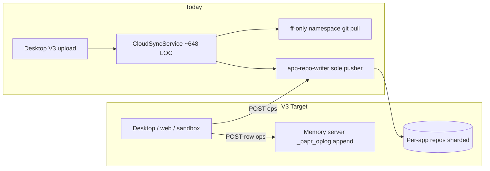
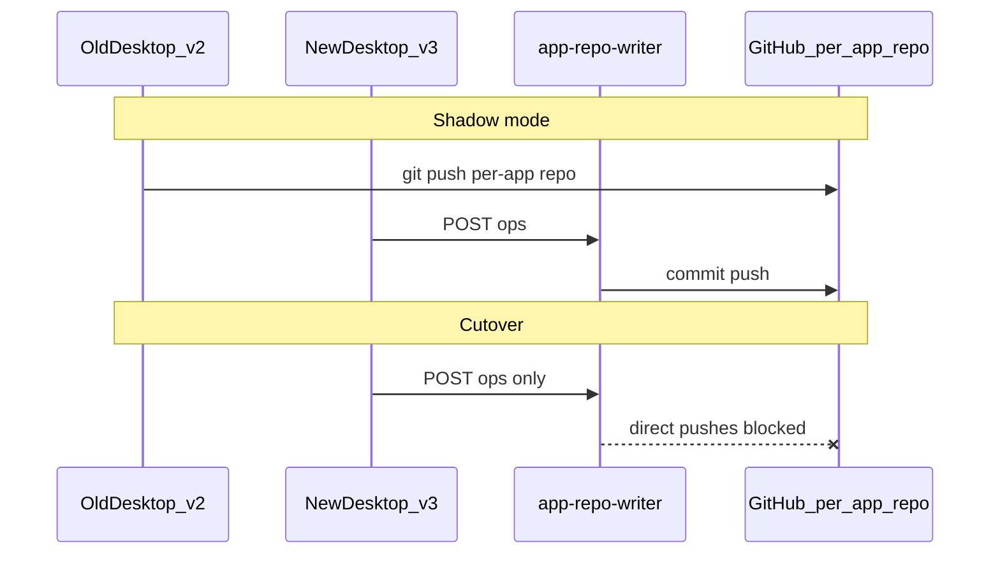

# Paprwork Sync V3 — Detailed Implementation Plan

**Status:** Active — Sync V3 implemented locally through Phase 4b/4.6 cutover plumbing (2026-08-18)

**Scope:** Full stack — **paprwork-v2** (desktop gateway + cloud-app-host), **memory** server ([`../memory`](../memory); dashboard/papr-dev-platform only proxies), **app-repo-writer** Cloud Run service.

**Binding spec:** [`SYNC_ARCHITECTURE_V3.md`](./SYNC_ARCHITECTURE_V3.md) (canonical); [`SYNC_CONTRACT.md`](./SYNC_CONTRACT.md) header points V3 implementation here.

**Success metric:** Legacy fingerprint Turso push, post-push verify, convergence gates, and desktop writer secrets are **removed** — not feature-flagged.

### Progress snapshot (2026-08-18)

| Phase | Status |
| --- | --- |
| Phase 0 | **Complete** — contract tests, metrics, handshake |
| Phase 1 | **Complete (local)** — per-app repos, RepoRegistry, runtime off git, migration job |
| Phase 2 | **Complete (local)** — writer service, SyncOutbox, AppSaveWatcher, flushAppNow writer path; [`CloudSyncService.ts`](../src/gateway/services/CloudSyncService.ts) **~648 LOC** (was ~2,735) |
| Phase 3 | **Complete (local code)** — workspace log plumbing + genesis orchestrator; fingerprint push/pull **deleted**; **schema execution via log (2026-08-19)**; prod genesis + replay CI pending |
| Phase 4 | **Complete (local code path)** — linked jobs + schema-owner migrations via writer ops; memory reads app-repo `jobs/` |
| Phase 4b | **In progress (local code done)** — SSE dispatch + desktop scheduler deferral + heartbeat drain off; **memory deploy + prod proof pending** |
| Phase 4.6 | **In progress (local code done)** — Mongo metadata registries + desktop dual-write; **namespace git metadata push stopped**; prod Mongo authority pending |
| Phase 5 | **Not started** — immutable releases, host pinned to release commit |

**Shipped locally (paprwork-v2):**
- Apps + linked job code + owner migrations → `app-repo-writer` ops ([`collectAppOpFiles.ts`](../src/gateway/services/syncV3/collectAppOpFiles.ts))
- `schemaOwnerAppId` on [`DatabaseRecord`](../src/gateway/services/DatabaseRegistryService.ts); owner ships `databases/{slug}/migrations/`
- Namespace git **no longer pushes** linked `Jobs/{id}/`, `data/jobs.json`, or `data/` on app flush ([`resolveAppDependentJobs.ts`](../src/gateway/services/cloudSync/resolveAppDependentJobs.ts), [`flushAppNow.ts`](../src/gateway/services/cloudSync/flushAppNow.ts))
- Rows: `_papr_sync_log` → workspace log → Turso (memory) + local SQLite (desktop materializer); [`tursoSyncBridgeCore.ts`](../src/gateway/services/tursoSyncBridgeCore.ts) push/pull **delegate to workspace log** (fingerprint CDC deleted)
- Genesis cutover orchestrator: [`workspaceLogGenesisCutover.ts`](../src/gateway/services/syncV3/workspaceLogGenesisCutover.ts), [`workspaceLogCutoverState.ts`](../src/gateway/services/syncV3/workspaceLogCutoverState.ts)
- Phase 4b desktop: [`runtimeDispatchSubscriber.ts`](../src/gateway/services/syncV3/runtimeDispatchSubscriber.ts); [`cloudSchedulerAuthority.ts`](../src/gateway/utils/cloudSchedulerAuthority.ts) defers cloud-capable jobs when dispatch is on; heartbeat `pendingCloudRuns` drain **skipped** when `SYNC_V3_DISPATCH_PUSH` enabled
- Phase 4.6 desktop: [`MetadataRegistryClient.ts`](../src/gateway/services/syncV3/MetadataRegistryClient.ts) dual-writes on `JobsService.saveJobs()` + `DatabaseRegistryService.save()`
- Cloud mini-apps: `TursoDbAdapter` appends via workspace log API (no direct Turso writes on cloud-app-host)
- Namespace git: ff-only auto-pull; diverged history → `requires_review` (no auto-merge repair)
- Removed from hot path + deleted: `postPushVerify`, `convergenceChecker`, `convergenceHash`, `tursoLinkedSourcePush`
- Pub/Sub: writer publishes to `PAPR_APP_REPO_COMMITTED_TOPIC`; cloud-app-host `/internal/app-repo-committed` consumes push/webhook; desktop fans out in-process after writer ops
- [`CloudSyncService.ts`](../src/gateway/services/CloudSyncService.ts) slimmed to **~648 LOC** — upload via V3 only; pull-only namespace git. Logic extracted to [`cloudSync/`](../src/gateway/services/cloudSync/) modules including [`cloudSyncPushApi.ts`](../src/gateway/services/cloudSync/cloudSyncPushApi.ts), [`cloudSyncHost.ts`](../src/gateway/services/cloudSync/cloudSyncHost.ts), [`cloudSyncSingleton.ts`](../src/gateway/services/cloudSync/cloudSyncSingleton.ts) (54 files under `cloudSync/`)

**Shipped locally (memory server):**
- [`app_repo_fetch_service.py`](../memory/services/app_repo_fetch_service.py) — app repo `jobs/{id}/` first, legacy namespace `Jobs/{id}/` fallback
- Consumers updated: [`cloud_workspace_repo_service.py`](../memory/services/cloud_workspace_repo_service.py), [`cloud_app_catalog_platform.py`](../memory/services/cloud_app_catalog_platform.py), [`cloud_app_runtime_service.py`](../memory/services/cloud_app_runtime_service.py)
- Workspace log append/apply: [`workspace_log_service.py`](../memory/services/workspace_log_service.py)
- Phase 4b: `GET /v1/cloud/runtime/dispatch/stream` SSE ([`cloud_runtime_routes.py`](../memory/routers/v1/cloud_runtime_routes.py)); cloud scheduler skips `executionCapability === "local-only"` ([`cloud_scheduler_service.py`](../memory/services/cloud_scheduler_service.py))
- Phase 4.6: [`namespace_metadata_registry_service.py`](../memory/services/namespace_metadata_registry_service.py) + [`cloud_metadata_routes.py`](../memory/routers/v1/cloud_metadata_routes.py); Mongo-first reads in workspace repo + linked sources
- Unit tests: [`test_app_repo_fetch_service.py`](../memory/tests/test_app_repo_fetch_service.py), [`test_namespace_metadata_registry.py`](../memory/tests/test_namespace_metadata_registry.py)

**E2E verified (2026-08-18, local memory `:5001`):**
- paprwork-v2: `npm run test:sync-v3-e2e` → **10/10 passed**
- memory: `test_app_repo_fetch_service.py` + `test_sync_v3_integration.py` → **8/8 passed**

**Schema execution (2026-08-19, local):**

| Component | Status |
| --- | --- |
| Memory `schema_migration_executor.py` | ✅ Implemented — applies `migrationId` + `ops`/`statements` on Turso append |
| Desktop `ensureReplicaReady` | ✅ drift-heal → schema ship → row ship |
| Desktop `LogMaterializer` | ✅ catch-up applies migration payloads with ledger dedupe |
| Schema log (workspace log DDL) | ✅ Always on — no env flag |
| Joe / Deck Studio E2E | ⏳ Pending — restart gateway after memory deploy |

**E2E verified (2026-08-19, local memory `:5001` + schema log):**
- Run: `PAPR_MEMORY_SERVER_URL=http://127.0.0.1:5001 npm run test:sync-v3-e2e`
- Result: **26/26 passed** (includes inline schema + `migrationId`/`statements` migration append)

**Remaining before production:**

| Priority | Work | Blocker? |
| --- | --- | --- |
| **Deploy** | memory server + app-repo-writer to prod (app-repo fetch, workspace log Turso apply, dispatch SSE, metadata routes) | Yes |
| **Deploy** | Set `CLOUD_SCHEDULER_ENABLED=1` + scheduler API key on memory prod | Yes (Phase 4b) |
| **Infra** | GCP Pub/Sub push subscription → `https://apps.papr.ai/internal/app-repo-committed` | Yes (Phase 2 fanout) |
| **Dogfood** | Run namespace → per-app split (1.3) on internal namespace; branch protection (writer sole pusher) | Yes (Phase 1 exit) |
| **Phase 3 prod** | Capture **3 production workload samples**; replay CI green; per-DB genesis cutover in prod | Yes (row sync cutover) |
| **Phase 4b prod** | Prove dispatch SSE end-to-end in prod; then **delete** [`applyPendingCloudRunPatches`](../src/gateway/services/cloudSync/applyPendingCloudRunPatches.ts) heartbeat path entirely | After dispatch proven |
| **Phase 4.6 prod** | Confirm Mongo reads authoritative in dogfood; stop relying on namespace git `data/` fallback reads | After dogfood |
| **Phase 5** | Immutable releases, host pinned to release commit, delete publish drift repair | Future |
| **Standalone jobs** | Mini-repos for jobs not linked to an app (today: namespace `Jobs/{id}/` git or local-only) | Future |
| **Cloud sandbox** | **Turso incremental:** ✅ [`cloudAgentTursoDebouncedPush.ts`](../src/gateway/services/cloudAgentGateway/cloudAgentTursoDebouncedPush.ts). **Writer ops:** ✅ [`cloudAppWriterDebouncedPush.ts`](../src/gateway/services/cloudAgentGateway/cloudAppWriterDebouncedPush.ts) + [`finalizeAppRepoMutation.ts`](../src/gateway/services/syncV3/finalizeAppRepoMutation.ts). Path alignment (`Jobs/` vs `jobs/` materialization) | Partial |
| **Cleanup** | ~~Delete git repair layer~~ ✅ [`namespaceGitReview.ts`](../src/gateway/services/cloudSync/namespaceGitReview.ts) replaces deleted `gitRemoteReconcile.ts` (ff-only review helpers) | Done |
| **Cleanup** | Delete [`jobMigrationLedgerSync.ts`](../src/gateway/services/jobs/jobMigrationLedgerSync.ts) after all DBs on log mode | After Phase 3 prod |
| **Ops** | Metrics dashboards (Amplitude / ops); `post_cutover_v2_push_count` alert | Recommended |

### Path convention: `Jobs/` vs `jobs/` (intentional)

Three layers, three spellings — **not a bug**, but every reader/writer must know which layer it is on:

| Layer | Path | Why |
| --- | --- | --- |
| **Desktop local disk** | `$PAPR_HOME/Jobs/{jobId}/` | Unchanged since V1; all job tools, schedulers, and agents use this |
| **Per-app GitHub repo (Sync V3)** | `jobs/{jobId}/` | New app-repo layout alongside repo-root app files and lowercase `databases/` |
| **Legacy namespace git** | `Jobs/{jobId}/` | Pre–Sync V3 monorepo; kept for fallback until namespaces are split/migrated |

**Mapping:** [`collectAppOpFiles.ts`](../src/gateway/services/syncV3/collectAppOpFiles.ts) reads local `Jobs/{id}/` and writes repo ops as `jobs/{id}/…`. Memory server tries app-repo `jobs/` first, then legacy `Jobs/` ([`app_repo_fetch_service.py`](../memory/services/app_repo_fetch_service.py)).

**Risk if ignored:** code that assumes cloud git paths equal local paths will miss linked job files after cutover. **Mitigation:** memory fallback covers read paths; writer only emits lowercase `jobs/` in app repos; local desktop never changes.

**Not an issue on macOS/Windows** (case-insensitive) because `Jobs/` and `jobs/` live in **different repos** (namespace vs per-app). **Linux** is safe as long as the mapping layer is used — never copy app-repo `jobs/` into `$PAPR_HOME/jobs/` without an explicit adapter.

**Future option:** rename app-repo prefix to `Jobs/` for spelling parity — would require writer + memory + docs change; no user disk impact. Current lowercase choice distinguishes app-repo tree from legacy namespace tree during migration.

---

## Current state (baseline)

| Area | Today | Primary files |
| --- | --- | --- |
| Git sync | Namespace git **pull-only** on desktop; upload via writer ops + workspace log (no namespace git push) | [`CloudSyncService.ts`](../src/gateway/services/CloudSyncService.ts) (~648 LOC), [`cloudSync/`](../src/gateway/services/cloudSync/), [`syncV3/`](../src/gateway/services/syncV3/) |
| V3 handshake | Desktop sends `syncProtocol` + capabilities on heartbeat | [`buildDesktopHeartbeatBody.ts`](../src/gateway/services/syncV3/buildDesktopHeartbeatBody.ts) |
| RepoRegistry | Memory server GET/ensure + Mongo; ShardManager assigns `PAPR_APP_REPO_SHARD_ORGS` pool | [`app_repo_registry_service.py`](../memory/services/app_repo_registry_service.py), [`app_repo_shard_manager.py`](../memory/services/app_repo_shard_manager.py) |
| Repair layer | **Deleted** — auto-merge repair removed; [`namespaceGitReview.ts`](../src/gateway/services/cloudSync/namespaceGitReview.ts) retains ff-only review helpers | ✅ |
| Turso rows | Workspace log ship + materialize (fingerprint CDC **deleted** from push/pull entrypoints) | [`tursoSyncBridgeCore.ts`](../src/gateway/services/tursoSyncBridgeCore.ts) (~935 LOC), [`workspaceLogSync.ts`](../src/gateway/services/syncV3/workspaceLogSync.ts) |
| Job metadata | Mongo registry (dual-write desktop); namespace git `data/` **no longer pushed** | [`MetadataRegistryClient.ts`](../src/gateway/services/syncV3/MetadataRegistryClient.ts), [`namespace_metadata_registry_service.py`](../memory/services/namespace_metadata_registry_service.py) |
| Job runtime | **Always off git** (no env opt-out); heartbeat patches | [`jobRuntimeOffGit.ts`](../src/gateway/services/jobs/jobRuntimeOffGit.ts), [`applyPendingCloudRunPatches.ts`](../src/gateway/services/cloudSync/applyPendingCloudRunPatches.ts) |
| Legacy repo init | Memory server `POST /v1/cloud/repos/init`, scope `"user"` | [`cloudReposScope.ts`](../src/core/utils/cloudReposScope.ts) |
| Publish | Drift repair, fire-and-forget host notify | [`CloudAppPublishService.ts`](../src/gateway/services/CloudAppPublishService.ts), [`notifyCloudAppRevision.ts`](../src/gateway/services/cloudSync/notifyCloudAppRevision.ts) |
| Frozen APIs | `/api/db/*`, `/api/jobs/run` | [`gateway/index.ts`](../src/gateway/index.ts), [`CloudAppHostService.ts`](../src/gateway/services/appRuntime/CloudAppHostService.ts) |
| Not yet | `_papr_oplog` | Phase 3 |
| Phase 1.2 (done) | `GET /v1/cloud/shards/status` | [`app_repo_shard_manager.py`](../memory/services/app_repo_shard_manager.py) |
| Phase 2 (local) | `app-repo-writer`, desktop ops client, outbox/OID cache | [`app-repo-writer.ts`](../src/gateway/app-repo-writer.ts), [`syncV3/`](../src/gateway/services/syncV3/) |



---

## Phase 0 — Foundation (2 weeks)

**Goal:** Instrumentation, contract tests, flags, and doc landing before any behavior change.

### 0.1 Contract test harness (paprwork-v2)

Add [`tests/mini-app-api-contract.test.ts`](../tests/mini-app-api-contract.test.ts) that pins **request/response shapes** for:

- `POST /api/db/query`, `/api/db/write`, `/api/db/exec`, `/api/db/batch`
- `POST /api/jobs/run`, `/api/jobs/status`, `/api/jobs/list`

Run against **both** plumbing paths during migration (old fingerprint path vs new log path) — §8.2 frozen contract.

Reference policy: [`miniAppApiPolicy.ts`](../src/gateway/services/appRuntime/miniAppApiPolicy.ts), existing [`tests/cloud-app-host-*.test.ts`](../tests/).

**Status:** ✅ Done

### 0.2 Feature flags (all services)

| Flag | Owner | Default | Deletion criterion | Status |
| --- | --- | --- | --- | --- |
| `SYNC_V3_PER_APP_REPOS` | memory server | off | All namespaces migrated | ✅ wired |
| `SYNC_V3_WRITER_OPS` | memory server | off | Zero v2 clients 30d | ✅ wired |
| `SYNC_V3_LOG_ROWS` | per-DB | off | Genesis verified + fingerprints deleted | ✅ wired |
| `SYNC_V3_DISPATCH_PUSH` | memory server | off | Heartbeat poll path deleted | ✅ wired |
| `SYNC_V3_RELEASES` | cloud-app-host | off | Drift repair deleted | ✅ wired |

Implementation: [`src/core/types/syncV3.ts`](../src/core/types/syncV3.ts), [`src/gateway/services/syncV3/syncV3Flags.ts`](../src/gateway/services/syncV3/syncV3Flags.ts).

**Note:** Current dev/desktop build reports all V3 capabilities as **always-on** via `IMPLEMENTED_CAPABILITIES` (no env rollout). Prod namespace overrides and straggler v2 client gating remain ⏳.

### 0.3 Capability handshake

- Desktop/gateway reports `syncProtocol: "v2" | "v3"` on heartbeat [`cloudSyncHeartbeat.ts`](../src/gateway/services/cloudSync/cloudSyncHeartbeat.ts) — ✅
- Memory server accepts Sync V3 fields via [`DesktopHeartbeatRequest`](../memory/models/cloud_models.py) — ✅
- Memory server tracks live protocol versions per namespace (required for §8.3 shadow cutover) — ⏳

### 0.4 Metrics baseline

Emit from day one:

- `v2_direct_push_count`, `v3_op_count`, `writer_conflict_count`, `oplog_append_latency_p99`
- `scheduler_missed_fire_count`, `post_cutover_v2_push_count` (auto-rollback trigger)

Implementation: [`syncV3Metrics.ts`](../src/gateway/services/syncV3/syncV3Metrics.ts), [`gatewayTelemetry.ts`](../src/gateway/services/gatewayTelemetry.ts). Dashboards: ⏳

### 0.5 Documentation

- [`docs/SYNC_ARCHITECTURE_V3.md`](./SYNC_ARCHITECTURE_V3.md) — ✅
- This file — ✅

**Exit criteria:**

- [x] Contract tests green — [`tests/mini-app-api-contract.test.ts`](../tests/mini-app-api-contract.test.ts)
- [x] Flags wired (default off)
- [x] Metrics counters + telemetry sink
- [x] Desktop heartbeat reports `syncProtocol`
- [ ] Metrics dashboards exist (Amplitude / ops)
- [ ] 3 workload samples stored securely for replay CI

---

## Phase 1 — Per-app repos + finish JOB_RUNTIME_OFF_GIT (4–6 weeks)

**Goal:** Split namespace monorepo server-side; stand up **RepoRegistry**; finish runtime-off-git; **no writer yet** (desktop may still git-push to per-app repos).

**Dependency:** Phase 1 **must complete before Phase 2 shadow** — v2 pushes target per-app repos, not legacy namespace monorepo.

### 1.1 Finish JOB_RUNTIME_OFF_GIT (paprwork-v2 + memory)

| Task | Files | Action | Status |
| --- | --- | --- | --- |
| Remove git fallback for runtime | [`CloudSyncService.handlePendingCloudRuns`](../src/gateway/services/CloudSyncService.ts), [`applyPendingCloudRunPatches.ts`](../src/gateway/services/cloudSync/applyPendingCloudRunPatches.ts) | Patch-only heartbeat path | ✅ |
| Remove git runtime writeback | [`persist_job_runtime_service.py`](../memory/services/persist_job_runtime_service.py) | Mongo + heartbeat only | ✅ |
| Always-off-git helpers | [`job_runtime_off_git.py`](../memory/services/job_runtime_off_git.py) | `should_git_write_job_runtime()` always false | ✅ |
| Mongo runtime merge | [`namespace_job_runtime_service.py`](../memory/services/namespace_job_runtime_service.py) | Always merges Mongo runtime | ✅ |
| Remove opt-out branch | [`jobRuntimeOffGit.ts`](../src/gateway/services/jobs/jobRuntimeOffGit.ts) | `isJobRuntimeOffGit()` always true | ✅ |
| Legacy reconcile classifiers | [`gitRemoteReconcile.ts`](../src/gateway/services/cloudSync/gitRemoteReconcile.ts) | Delete runtime-metadata paths — **deferred Phase 2**; stragglers tagged `V3-PHASE2-DELETE` | ⏳ Phase 2 |

**Exit criterion:**

- [x] No new job `status`/`lastRunAt` in git diffs (runtime path is patch-only)
- [x] Runtime 100% via heartbeat API (desktop + memory)
- [ ] Runtime-metadata reconcile paths deleted — **Phase 2 cutover**
- [x] Straggler source-code classifiers retained with Phase 2 deletion tag

**Audit** (2026-08-18 — clean except Phase 2 stragglers):

```bash
rg "JOB_RUNTIME_OFF_GIT=0|isLegacyJobRuntimeGitPath|scheduleState.*git" src/
# → only isLegacyJobRuntimeGitPath in gitRemoteReconcile.ts
```

### 1.2 RepoRegistry + shard manager (memory server)

New module: [`services/app_repo_registry_service.py`](../memory/services/app_repo_registry_service.py) (uses [`github_repos.py`](../memory/services/github_repos.py)).

**Schema (server-side only):**

```
AppRepoRecord:
  app_id: str
  namespace_id: str
  github_org: str      # e.g. papr-shard-0042 (today: single GITHUB_ORG)
  repo_name: str       # e.g. app-{appId}
  shard_id: str
  created_at: datetime
  legacy_namespace_repo: str | null
```

**ShardManager logic** (Phase 1.2 — implemented in [`app_repo_shard_manager.py`](../memory/services/app_repo_shard_manager.py)):

- Pool of orgs `papr-shard-{NNNN}` via `PAPR_APP_REPO_SHARD_ORGS` (falls back to `GITHUB_ORG`)
- Pick lowest-count shard under `PAPR_APP_REPO_SHARD_MAX_REPOS` (default 80k)
- Lazy create: `ensure_app_repo_record` → `pick_shard_for_new_repo` → `ensure_app_repo`
- Rate-limit repo creates (~1 req/s) in `ensure_app_repo` via `await_repo_create_rate_limit`
- Delete repo on app delete — ⏳ Phase 1+

**APIs (memory server):**

| Endpoint | Purpose | Status |
| --- | --- | --- |
| `GET /v1/cloud/apps/{appId}/repo` | Return cloneUrl from registry | ✅ |
| `POST /v1/cloud/apps/{appId}/repo/ensure` | Lazy create (idempotent) | ✅ |
| `GET /v1/cloud/shards/status` | Internal ops: utilization per shard | ✅ |

Clients **never construct repo URLs** (§8.4).

### 1.3 Namespace → per-app split migration (cloud job)

One-time job per namespace (memory server script + Cloud Run job):

1. `git clone` namespace repo to temp
2. For each `apps/{appId}/`: `git filter-repo` → new repo in assigned shard
3. Preserve history per app; register in RepoRegistry
4. Archive namespace repo **read-only** (never delete)
5. Update memory server `cloneUrl` responses to per-app records

**Desktop impact:** None on disk paths (`$PAPR_HOME/apps/{id}/` unchanged).

**Status:** ✅ Implemented (memory server)

| Component | Location |
| --- | --- |
| Migration orchestrator | [`namespace_app_split_migration_service.py`](../memory/services/namespace_app_split_migration_service.py) |
| git + filter-repo helpers | [`git_filter_repo.py`](../memory/services/git_filter_repo.py) |
| CLI / Cloud Run entry | [`scripts/sync_v3/migrate_namespace_apps.py`](../memory/scripts/sync_v3/migrate_namespace_apps.py) |
| HTTP API | `POST /v1/cloud/namespaces/app-split/migrate`, `GET .../status` |
| Auth | Cloud API key + `SYNC_V3_MIGRATION_TOKEN` for live runs (dry-run skips token) |
| Tests | [`test_namespace_app_split_migration.py`](../memory/tests/test_namespace_app_split_migration.py) |

**Requires on host:** `git`, `git-filter-repo`, GitHub App env vars, Mongo for RepoRegistry + migration state.

```bash
# Dry run (discover apps, no push/archive)
cd ../memory
poetry run python scripts/sync_v3/migrate_namespace_apps.py \\
  --org-id ORG --namespace-id NS --dry-run

# Live migration
SYNC_V3_MIGRATION_TOKEN=... poetry run python scripts/sync_v3/migrate_namespace_apps.py \\
  --org-id ORG --namespace-id NS
```

### 1.4 Desktop gateway adjustments (paprwork-v2)

| Task | Files | Status |
| --- | --- | --- |
| Per-app repo metadata client | [`AppRepoClient.ts`](../src/gateway/services/syncV3/AppRepoClient.ts), [`appRepoRegistry.ts`](../src/core/types/appRepoRegistry.ts), cache `data/app-repo-registry.json` | ✅ |
| Resolve repo on git push when `SYNC_V3_PER_APP_REPOS=1` | [`cloudSyncPushApi.ts`](../src/gateway/services/cloudSync/cloudSyncPushApi.ts) via [`CloudSyncService.pushGitNow`](../src/gateway/services/CloudSyncService.ts) | ✅ V3 writer + workspace log only |
| Contribute-back validates owner repo URL | [`CloudAppContributeService`](../src/gateway/services/CloudAppContributeService.ts) | ✅ |
| Heartbeat Sync V3 handshake | [`buildDesktopHeartbeatBody.ts`](../src/gateway/services/syncV3/buildDesktopHeartbeatBody.ts) | ✅ |

**Keep for Phase 1:** [`ensureRemoteCaughtUp`](../src/gateway/services/CloudSyncService.ts), [`gitRemoteReconcile.ts`](../src/gateway/services/cloudSync/gitRemoteReconcile.ts) — still needed until writer cutover eliminates multi-pusher races. (`postPushVerify` deleted.)

**Exit criteria:**

- [ ] New namespaces get per-app repos from day one (blocked on 1.3 + flag rollout)
- [ ] One dogfood namespace migrated; monorepo archived read-only
- [ ] Live GitHub dogfood — `npm run test:sync-v3-e2e -- --require-github`
- [x] RepoRegistry `ensure` idempotent — unit + route + E2E tests
- [x] Runtime off git verified — audit clean except Phase 2 classifiers
- [x] Unit + E2E tests — see test matrix below

### Test matrix (Phase 1 — runnable locally)

**paprwork-v2 unit:** [`sync-v3-heartbeat.test.ts`](../tests/sync-v3-heartbeat.test.ts), [`app-repo-client.test.ts`](../tests/app-repo-client.test.ts), [`push-app-via-writer-ops.test.ts`](../tests/push-app-via-writer-ops.test.ts), [`job-runtime-off-git.test.ts`](../tests/job-runtime-off-git.test.ts), [`mini-app-api-contract.test.ts`](../tests/mini-app-api-contract.test.ts), [`cloud-sync-heartbeat-runtime.test.ts`](../tests/cloud-sync-heartbeat-runtime.test.ts)

**paprwork-v2 E2E (live memory):** `npm run test:sync-v3-e2e` ([`scripts/test-sync-v3-e2e.mjs`](../scripts/test-sync-v3-e2e.mjs)), `npm run test:sync-v3-e2e:full`, `npm run test:sync-v3-e2e:vitest` ([`test/e2e/sync-v3.e2e.test.ts`](../test/e2e/sync-v3.e2e.test.ts))

**memory unit (mocked):** [`test_app_repo_registry_service.py`](../memory/tests/test_app_repo_registry_service.py), [`test_app_repo_shard_manager.py`](../memory/tests/test_app_repo_shard_manager.py), [`test_app_repo_shards_routes.py`](../memory/tests/test_app_repo_shards_routes.py), [`test_cloud_app_repo_routes.py`](../memory/tests/test_cloud_app_repo_routes.py), [`test_cloud_runtime_routes.py`](../memory/tests/test_cloud_runtime_routes.py), [`test_job_runtime_off_git.py`](../memory/tests/test_job_runtime_off_git.py), [`test_persist_job_runtime_service.py`](../memory/tests/test_persist_job_runtime_service.py)

**memory live HTTP:** [`test_sync_v3_integration.py`](../memory/tests/test_sync_v3_integration.py); cloud sequential — [`test_cloud_endpoints_integration.py`](../memory/tests/test_cloud_endpoints_integration.py)

```bash
# Terminal 1: memory server
cd ../memory && poetry run python main.py

# Terminal 2: E2E
PAPR_API_KEY=sk-... PAPR_MEMORY_SERVER_URL=http://127.0.0.1:5001 npm run test:sync-v3-e2e
```

RepoRegistry `ensure` needs `GITHUB_APP_*` + `GITHUB_ORG` on memory server; without GitHub the script skips repo tests (`--require-github` to fail instead).

### Phase 1 remaining (next up)

1. ~~**1.3 migration job** — filter-repo per app; archive namespace monorepo~~ ✅
2. ~~**ShardManager** — multi-org pool + `GET /v1/cloud/shards/status`~~ ✅
3. **Run 1.3** on internal dogfood namespace (after full plan complete)
4. ~~**Lazy ensure** on first cloud save / publish path~~ ✅ — `flushAppNow` → `pushAppViaWriterOps` → `ensureAppRepoRecord`; `resolveAppRepoForSync` on namespace git pushes when `SYNC_V3_PER_APP_REPOS=1`
5. ~~**Doc follow-up** — [`SYNC_CONTRACT.md`](./SYNC_CONTRACT.md) runtime section updated to "always off git"~~ ✅

---

## Phase 2 — app-repo-writer + client ops path (6–8 weeks)

**Goal:** Sole pusher for `main`; clients POST ops; shadow mode with hard invariants; delete ~8k lines of git repair code after cutover.

### 2.1 New service: app-repo-writer

**Location:** [`src/gateway/app-repo-writer.ts`](../src/gateway/app-repo-writer.ts) (Cloud Run peer to [`cloud-app-host.ts`](../src/gateway/cloud-app-host.ts)).

**Status:** ✅ Implemented locally — `npm run start:app-repo-writer` (port 8789). Deploy script ready; **do not deploy until local dogfood passes**.

**Files:** [`AppRepoWriterService.ts`](../src/gateway/services/appRepoWriter/AppRepoWriterService.ts), [`githubWorktree.ts`](../src/gateway/services/appRepoWriter/githubWorktree.ts), [`parentHashVerify.ts`](../src/gateway/services/appRepoWriter/parentHashVerify.ts), [`abuseFilter.ts`](../src/gateway/services/appRepoWriter/abuseFilter.ts), [`Dockerfile.cloud-app-repo-writer`](../Dockerfile.cloud-app-repo-writer), [`deploy-cloud-app-repo-writer.mjs`](../scripts/deploy-cloud-app-repo-writer.mjs).

**Estimated scope:** 2,000–3,000 LOC. See [`SYNC_ARCHITECTURE_V3.md` §1](./SYNC_ARCHITECTURE_V3.md).

**Core endpoints:**

```
POST /apps/{appId}/ops
  { files: [{ path, content, parentHash }], author, message, idempotencyKey }
  → 200 { commitSha, files: [{ path, blobOid }] }
  → 409 { conflict: true, artifacts: [...] }

POST /internal/webhooks/github
GET  /health
```

**Writer algorithm (per appId mutex — Redis or Firestore lock):**

1. Resolve `appId → org/repo` from RepoRegistry
2. Clone/fetch shallow working copy (cached with TTL)
3. Compare `parentHash` to blob OID at HEAD per path
4. Match → commit + push; mismatch → conflict artifact
5. Emit Pub/Sub `app-repo-committed`

**Abuse rejection:** Reject ops before git — max file size, deny `*.db`, `tmp_pack_*` ([`repoHygiene.ts`](../src/gateway/services/cloudSync/repoHygiene.ts) rules move here).

**parentHash spec:** Git blob OID via local `git hash-object` subprocess (locked decision).

### 2.2 Desktop sync client (paprwork-v2)

[`src/gateway/services/syncV3/`](../src/gateway/services/syncV3/) **already exists** with Phase 0/1 modules. Phase 2 **adds**:

| Component | Role | Status |
| --- | --- | --- |
| `AppRepoClient.ts` | Fetch/cache per-app repo metadata | ✅ Phase 1 |
| `syncV3Flags.ts` / `syncV3Metrics.ts` | Capability flags + counters | ✅ Phase 0 |
| `buildDesktopHeartbeatBody.ts` | Handshake payload | ✅ Phase 0 |
| `SyncOutbox.ts` | Persist queued ops; retry with backoff | ✅ Phase 2 (local) |
| `AppOpsClient.ts` | POST ops to writer; compute parentHash | ✅ Phase 2 (local) |
| `OidCache.ts` | Last-synced blob OID per `(appId, path)` | ✅ Phase 2 (local) |
| `AppSaveWatcher.ts` | Writer-ops dirty signal from AppService watcher | ✅ Phase 2 (local) |
| `pushAppViaWriterOps.ts` | Ordered flush git leg replacement | ✅ Phase 2 (local) |
| `cutoverState.ts` | Shadow/cutover mode mirror (dev) | ✅ Phase 2 |
| `appRepoCommittedFanout.ts` | In-process + webhook fanout with cursor dedup | ✅ Phase 2 |
| `appRepoRevisionSubscriber.ts` | cloud-app-host revision notify on commit | ✅ Phase 2 |

**Flow:**

```
AppService watcher (change)
  → debounce 35s (SyncCoordinator timing)
  → read file + parentHash from OID cache
  → SyncOutbox.append(op) → flush → AppOpsClient.postOps
  → success: update cache; 409: conflict UI event
```

#### OID cache invalidation (locked)

Persist `~/Papr/data/sync-oid-cache.json` (or per-app sidecar):

| Event | Action |
| --- | --- |
| Op acked with `commitSha` | Update OIDs from writer response |
| Outbox replay after crash | Re-read file; recompute `parentHash` from cache |
| Cache miss | Fetch HEAD tree via writer read API |
| 409 conflict | Invalidate path; surface UI; no auto-retry with stale parent |

### 2.3 Shadow mode + cutover

Per namespace (§8.3):

1. **Shadow:** v3 clients POST ops; v2 clients git-push to per-app repos
2. **Metrics gate:** Cutover when all clients report `syncProtocol: v3`
3. **Cutover:** Branch protection — writer sole pusher
4. **Auto-rollback:** `post_cutover_v2_push_count` → flip to shadow + alert

### 2.4 Notification fanout (Pub/Sub) — load-bearing

Replace [`notifyCloudAppRevision.ts`](../src/gateway/services/cloudSync/notifyCloudAppRevision.ts):

- Delivery SLO: 99.9% within 60s
- Cursor recovery: subscribers persist `{lastCommitSha}`
- Test: subscriber down 24h → backlog without duplicate side effects

### 2.5 Deletions after cutover (paprwork-v2)

Delete when `v2_direct_push_count == 0` for 30 days per namespace:

| Module | LOC | Reason obsolete |
| --- | ---: | --- |
| [`postPushVerify.ts`](../src/gateway/services/cloudSync/postPushVerify.ts) | — | **Deleted** |
| [`gitRemoteReconcile.ts`](../src/gateway/services/cloudSync/gitRemoteReconcile.ts) | 706 | no multi-pusher races |
| `ensureRemoteCaughtUp` in CloudSyncService | — | clients never push |
| [`repoMaintenance.ts`](../src/gateway/services/cloudSync/repoMaintenance.ts) + most of [`repoHygiene.ts`](../src/gateway/services/cloudSync/repoHygiene.ts) | ~290 | writer rejects at door |
| [`convergenceHash.ts`](../src/gateway/services/cloudSync/convergenceHash.ts) | — | N/A for git layer |

Slim [`CloudSyncService.ts`](../src/gateway/services/CloudSyncService.ts) target: <500 LOC — **mostly done (~648 LOC)**; optional polish remains (see Phase 2 cleanup checklist).

**Exit criteria:**

- [x] Writer service + desktop ops client implemented (local)
- [x] OID cache + outbox unit tests green
- [x] Cutover state + revision subscriber wired in gateway startup
- [x] Pub/Sub fanout cursor dedup tests green
- [x] OID cache crash-replay test green
- [x] Slim `CloudSyncService.ts` — **mostly done (~648 LOC)**; push/composer/singleton extracted (optional <500 LOC polish)
- [ ] Zero direct git pushes from desktop in prod (per namespace after cutover)
- [ ] Repair modules deleted (after 30-day cutover gate)

---

## Phase 3 — Workspace log v1 (rows + schema) (8–10 weeks)

**Goal:** Replace Turso fingerprint/`force:true` sync with ordered log replay; memory server is **sole log appender**.

### 3.1 Log storage (memory server + Turso)

```sql
CREATE TABLE _papr_oplog (
  replica_id TEXT NOT NULL,
  seq INTEGER NOT NULL,
  hlc TEXT NOT NULL,
  kind TEXT NOT NULL,  -- 'row' | 'schema' | 'snapshot'
  db_source_id TEXT,
  payload JSON NOT NULL,
  PRIMARY KEY (replica_id, seq)
);
```

**v1 scope:** row ops + schema events only. Job-status and publish stay on existing paths until Phases 4–5.

### 3.2 API (memory server)

```
POST /v1/workspace/log/append
GET  /v1/workspace/log/since?cursor=...
POST /v1/workspace/log/genesis
```

**Status:** ✅ Implemented — [`workspace_log_service.py`](../memory/services/workspace_log_service.py), [`workspace_log_routes.py`](../memory/routers/v1/workspace_log_routes.py)

### 3.3 Gateway integration (paprwork-v2)

| Today | V3 plumbing | Status |
| --- | --- | --- |
| [`/api/db/write`](../src/gateway/index.ts) → SQLite + Turso CDC | Gateway → memory `log/append` → [`LogMaterializer.ts`](../src/gateway/services/syncV3/LogMaterializer.ts) → local SQLite | ✅ when `SYNC_V3_LOG_ROWS=1` |
| [`TursoLinkedDbWatcher`](../src/gateway/services/TursoLinkedDbWatcher.ts) fingerprint dirty | Materializer catch-up from log cursor | ✅ `materializeWorkspaceLogSince` |
| [`tursoSyncBridgeCore`](../src/gateway/services/tursoSyncBridgeCore.ts) push/pull | Log ship + materialize only | ✅ fingerprint push/pull **deleted**; table-copy helpers retained for bootstrap/repair |

### 3.4 Genesis migration (per DB)

Quiesce → queue writes server-side → snapshot genesis → verify hash → flip `SYNC_V3_LOG_ROWS`. Rollback leaves fingerprint path working.

### 3.5 CI replay determinism test

[`tests/workspace-log-replay.test.ts`](../tests/workspace-log-replay.test.ts) using **3 captured production workloads** from Phase 0.

**Phase 3 fingerprint deletion blocked until replay CI passes.**

### 3.6 Deletions after Phase 3

- ~~`force:true` fingerprint push/pull in [`tursoSyncBridgeCore.ts`](../src/gateway/services/tursoSyncBridgeCore.ts)~~ ✅ **Deleted (2026-08-18)** — entrypoints delegate to workspace log
- Remaining `forcePush` options in [`TursoSyncBridge.ts`](../src/gateway/services/TursoSyncBridge.ts) (explicit repair/bootstrap only)
- Fingerprint state in [`tursoSyncState.ts`](../src/gateway/services/tursoSyncState.ts) / [`tursoPushScheduler.ts`](../src/gateway/services/tursoPushScheduler.ts) — cleanup after prod genesis
- [`jobMigrationLedgerSync.ts`](../src/gateway/services/jobs/jobMigrationLedgerSync.ts) (415 LOC) — after all DBs on log mode in prod

### 3.7 Design question: `flushAppNow.ts`

[`flushAppNow.ts`](../src/gateway/services/cloudSync/flushAppNow.ts) — **Option A (preferred):** delete flush chain; replace with parallel primitives. **Option B:** retarget without verify/reconcile steps. Decision at Phase 3 kickoff.

**Exit criterion:** Zero fingerprint Turso CDC in prod hot path; replay CI green; per-DB genesis complete.

**Status:** ✅ Genesis batch orchestrator (`runWorkspaceLogGenesisCutoverForAllLinkedSources`), replay CI on 3 fixtures (`prod-sample-{1,2,3}.json`), git repair layer deleted.

**Env reference:** [`SYNC_V3_ENV.md`](./SYNC_V3_ENV.md)

---

## Phase 4 — Linked job code in app repos + schema owner (local complete)

**Goal:** Linked job **source code** ships in per-app repos via writer ops; job/database **metadata** in Mongo (dual-write); memory server reads app-repo `jobs/`.

### 4.0 Job code cutover (paprwork-v2 + memory) — ✅ local

| Task | Files | Status |
| --- | --- | --- |
| `schemaOwnerAppId` on database registry | [`DatabaseRegistryService.ts`](../src/gateway/services/DatabaseRegistryService.ts) | ✅ |
| Collect linked jobs + owner migrations for writer ops | [`collectAppOpFiles.ts`](../src/gateway/services/syncV3/collectAppOpFiles.ts) | ✅ |
| Stop namespace git push for linked `Jobs/{id}/` | [`resolveAppDependentJobs.ts`](../src/gateway/services/cloudSync/resolveAppDependentJobs.ts) | ✅ |
| Writer flush marks synced paths | [`pushAppViaWriterOps.ts`](../src/gateway/services/syncV3/pushAppViaWriterOps.ts), [`flushAppNow.ts`](../src/gateway/services/cloudSync/flushAppNow.ts) | ✅ |
| Memory: fetch job files from app repo | [`app_repo_fetch_service.py`](../memory/services/app_repo_fetch_service.py) | ✅ |
| Memory: materialize job workspace | [`cloud_workspace_repo_service.py`](../memory/services/cloud_workspace_repo_service.py) | ✅ |
| Memory: catalog + runtime file serving | [`cloud_app_catalog_platform.py`](../memory/services/cloud_app_catalog_platform.py), [`cloud_app_runtime_service.py`](../memory/services/cloud_app_runtime_service.py) | ✅ |
| Tests | [`collect-app-op-files.test.ts`](../tests/collect-app-op-files.test.ts), [`test_app_repo_fetch_service.py`](../memory/tests/test_app_repo_fetch_service.py), E2E | ✅ |

**Exit criteria:**

- [x] Linked job code in app repo at `jobs/{id}/` (config-only `job.json`)
- [x] Namespace git no longer pushes `Jobs/{id}/` or `data/jobs.json` / `data/` on app flush
- [x] Memory reads app repo first, legacy `Jobs/` fallback
- [ ] Production deploy of memory + writer changes
- [ ] Live GitHub test: materialize job from app repo with real linked job content

### 4.1 Server scheduler (memory server) — ✅ local code; ⏳ prod deploy

**Goal:** Server owns cron; push dispatch to desktop; desktop defers cloud-capable jobs when authoritative.

| Component | Status |
| --- | --- |
| Memory cloud scheduler worker | ✅ [`cloud_scheduler_service.py`](../memory/services/cloud_scheduler_service.py) — skips `local-only` jobs |
| Desktop local scheduler deferral | ✅ [`cloudSchedulerAuthority.ts`](../src/gateway/utils/cloudSchedulerAuthority.ts) + [`JobsScheduler.ts`](../src/gateway/services/JobsScheduler.ts) |
| Prod enable | ⏳ Deploy memory + `CLOUD_SCHEDULER_ENABLED=1` + scheduler API key |

SLO: 99.9% on-time fire (not yet measured in prod).

### 4.2 Push dispatch channel — ✅ local code; ⏳ prod proof

| Component | Status |
| --- | --- |
| SSE `GET /v1/cloud/runtime/dispatch/stream` | ✅ memory [`cloud_runtime_routes.py`](../memory/routers/v1/cloud_runtime_routes.py) |
| Desktop subscriber | ✅ [`runtimeDispatchSubscriber.ts`](../src/gateway/services/syncV3/runtimeDispatchSubscriber.ts) |
| Heartbeat `pendingCloudRuns` drain | ✅ **Deleted** — runtime patches via SSE only ([`runtimeDispatchSubscriber.ts`](../src/gateway/services/syncV3/runtimeDispatchSubscriber.ts)) |
| Delete poll path entirely | ✅ Done locally — [`applyPendingCloudRunPatches`](../src/gateway/services/cloudSync/applyPendingCloudRunPatches.ts) kept for SSE dispatch only |

### 4.3 No degraded-mode dual scheduler (v1 cut — locked)

Server is sole firing authority for cloud-capable jobs when desktop is authoritative-deferred (cloud sync on + Papr auth + dispatch enabled).

### 4.4 Cloud execution safety — ⏳ not started

Idempotency keys, request-scoped contexts, concurrency > 1 once proven.

### 4.5 Job capability schema — ✅ local

```typescript
executionCapability: "local-only" | "cloud-capable"  // default: cloud-capable
```

Implemented in [`jobs/types.ts`](../src/gateway/services/jobs/types.ts); memory scheduler respects `local-only`.

### 4.6 Metadata registries off namespace git — ✅ local push stopped; ⏳ prod authority

| Component | Status |
| --- | --- |
| Mongo registry service + routes | ✅ [`namespace_metadata_registry_service.py`](../memory/services/namespace_metadata_registry_service.py), [`cloud_metadata_routes.py`](../memory/routers/v1/cloud_metadata_routes.py) |
| Mongo-first reads (jobs + databases) | ✅ workspace repo + linked sources |
| Desktop dual-write on save | ✅ [`MetadataRegistryClient.ts`](../src/gateway/services/syncV3/MetadataRegistryClient.ts) |
| Namespace git push of `data/jobs.json` / `data/` | ✅ **Stopped** — [`resolveAppDependentJobs.ts`](../src/gateway/services/cloudSync/resolveAppDependentJobs.ts), [`flushAppNow.ts`](../src/gateway/services/cloudSync/flushAppNow.ts) |
| Prod: confirm Mongo reads without git fallback | ⏳ Dogfood required before declaring cutover complete |

**Clarification:** Row data lives in **Turso + workspace log**, not git. Job **source code** for linked jobs is in per-app repos (`jobs/{id}/`). Legacy namespace `Jobs/{id}/` and `data/` remain as **read fallbacks** until migration completes — desktop **no longer pushes** metadata to namespace git.

**Exit criterion (full Phase 4):** Scheduled jobs fire with Mac asleep (prod); dispatch SSE proven; heartbeat poll code deleted; metadata Mongo-authoritative in dogfood/prod; idempotency tests green.

---

## Phase 5 — Immutable releases + cloud-app-host cutover (6–8 weeks)

**Goal:** Publish = pinned release; host stops being sync peer; delete drift repair.

### 5.1 Release model

Git tag `release-{semver}` + `release-manifest.json` at repo root (via writer). No UUID-regex discovery.

### 5.2 cloud-app-host redesign

Subscribe to writer/release Pub/Sub; serve **pinned release commit** only.

### 5.3 Install/track

[`CloudAppInstallService`](../src/gateway/services/CloudAppInstallService.ts) — transactional install from manifest.

Delete: [`cloudPublishDrift.ts`](../src/gateway/services/cloudPublishDrift.ts), drift heal in [`CloudAppPublishService.ts`](../src/gateway/services/CloudAppPublishService.ts).

**Exit criterion:** No publish drift incidents; `cloudPublishDrift` deleted.

---

## Cross-cutting: migration safety (§8)



| Rule | Enforcement |
| --- | --- |
| User app code never changes | Contract tests in CI |
| Straggler desktops | Min version gate after N months |
| Failed DB migration | Per-DB rollback flag; genesis hash gate |
| Flag ownership | Named owner + deletion date in code |

---

## Testing strategy

| Phase | Tests | Status |
| --- | --- | --- |
| 0 | Contract tests; flag plumbing | ✅ |
| 1 | Per-app repo E2E; migration dry-run; see test matrix above | ✅ |
| 2 | Writer unit: parentHash; shadow cutover; outbox offline retry | ✅ |
| 3 | Workspace log append + materializer replay tests | ✅ |
| 3 | Fingerprint push/pull deletion | ✅ local (2026-08-18) |
| 3 | Replay determinism on 3 prod workloads; genesis in prod | ⏳ |
| 4.0 | Linked jobs in app repo; memory app-repo fetch; collectAppOpFiles | ✅ |
| 4.6 | Metadata dual-write; namespace git metadata push stopped | ✅ local |
| 4 | Scheduler SLO; dispatch SSE prod proof; idempotency double-submit | ⏳ |
| 5 | Release pin immutability; host atomic swap; install from manifest | ⏳ |

Extend: [`cloud-publish-drift.test.ts`](../tests/cloud-publish-drift.test.ts), [`turso-sync-log.test.ts`](../tests/turso-sync-log.test.ts), [`job-runtime-off-git.test.ts`](../tests/job-runtime-off-git.test.ts), [`test-turso-phase1-oplog-e2e.mjs`](../scripts/test-turso-phase1-oplog-e2e.mjs).

---

## Repo ownership map

| Component | Repository | Team focus |
| --- | --- | --- |
| Desktop gateway, outbox, materializer, E2E | paprwork-v2 | Electron/gateway |
| RepoRegistry, job runtime, heartbeat, log append, scheduler | **memory** ([`../memory`](../memory)) | Memory server |
| Dashboard (proxies to memory) | papr-dev-platform | Web |
| app-repo-writer | papr-dev-platform / Cloud Run (Phase 2) | Cloud infra |
| cloud-app-host release consumer | paprwork-v2 | Edge serving |
| GitHub org provisioning | memory + DevOps | Enterprise account |

---

## Rough timeline (sequential phases, some overlap)

| Phase | Duration | Cumulative |
| --- | --- | --- |
| 0 Foundation | 2 wk | 2 wk |
| 1 Per-app repos | 4–6 wk | 8 wk |
| 2 Writer | 6–8 wk | 16 wk |
| 3 Log v1 | 8–10 wk | 26 wk |
| 4 Dispatch | 6–8 wk | 34 wk |
| 5 Releases | 6–8 wk | 42 wk |

Phases 3 and 4 can overlap after Phase 2 shadow is stable. **Do not start Phase 3 fingerprint deletion until replay CI passes.**

---

## Immediate next steps

**Done (2026-08-18):**
- [x] Phase 4 job-code cutover — writer ops + memory app-repo fetch
- [x] Phase 3 fingerprint deletion — `pushLocalDbToTurso` / `pullTursoToLocalDb` → workspace log
- [x] Phase 4.6 local — Mongo dual-write; stop namespace git metadata push
- [x] Phase 4b local — SSE dispatch subscriber; desktop scheduler deferral; heartbeat drain **deleted**
- [x] Sync V3 E2E — paprwork 10/10, memory 8/8 against local server
- [x] Type-check fixes — `MetadataRegistryClient` import path + typed dual-write payloads
- [x] Replay CI scaffolding — 3 synthetic fixtures under `tests/fixtures/workspace-log/` + capture script
- [x] Slim `CloudSyncService.ts` — **~648 LOC** (from ~2,735); push API → [`cloudSyncPushApi.ts`](../src/gateway/services/cloudSync/cloudSyncPushApi.ts), host factories → [`cloudSyncHost.ts`](../src/gateway/services/cloudSync/cloudSyncHost.ts), singleton → [`cloudSyncSingleton.ts`](../src/gateway/services/cloudSync/cloudSyncSingleton.ts); gateway tsc + 28/28 cloud-sync hardening tests green

**Next (production path — blocking GA):**
- [ ] Deploy memory server (app-repo fetch, workspace log, dispatch SSE, metadata routes, cloud scheduler)
- [ ] Deploy app-repo-writer to prod
- [ ] `CLOUD_SCHEDULER_ENABLED=1` + scheduler API key on memory prod
- [ ] Wire GCP Pub/Sub → `https://apps.papr.ai/internal/app-repo-committed`
- [ ] RepoRegistry **live dogfood** — run 1.3 namespace split on internal namespace
- [ ] Branch protection — writer sole pusher on per-app repos

**Next (Phase 3 prod cutover):**
- [ ] Capture **3 production workload samples** for replay CI fixtures — synthetic fixtures + [`scripts/capture-workspace-log-sample.mjs`](../scripts/capture-workspace-log-sample.mjs) ready; replace JSON under `tests/fixtures/workspace-log/` after dogfood
- [ ] Per-DB genesis migration in dogfood/prod
- [x] Clean up remaining fingerprint state in `tursoSyncState` / `tursoPushScheduler` after genesis — oplog cursors only; legacy `tableFingerprints` stripped on load/save

**Next (Phase 4b prod proof):**
- [ ] End-to-end: cloud scheduler fires job while Mac asleep; dispatch SSE delivers runtime patch
- [x] Delete heartbeat `pendingCloudRuns` drain ([`CloudSyncService`](../src/gateway/services/CloudSyncService.ts) — SSE dispatch only)

**Next (Phase 4.6 prod proof):**
- [ ] Dogfood: create/edit jobs + databases; verify cloud reads from Mongo without namespace git `data/` push

**Next (Phase 2 cleanup — after writer cutover):**
- [x] Delete `gitRemoteReconcile.ts` — replaced by slim `namespaceGitReview.ts` (ff-only; no auto-merge repair)
- [x] Stop namespace git push — [`pushV3Now.ts`](../src/gateway/services/cloudSync/pushV3Now.ts) + [`cloudSyncPushApi.ts`](../src/gateway/services/cloudSync/cloudSyncPushApi.ts) (`pushGitNow` → writer + workspace log only)
- [x] Remove dead push stack (`commitAndPushPaths`, `ensureRemoteCaughtUp`, `pushMainBranch`)
- [x] Extract queue + pull helpers — [`cloudSyncQueueProcessor.ts`](../src/gateway/services/cloudSync/cloudSyncQueueProcessor.ts), [`cloudSyncGitPull.ts`](../src/gateway/services/cloudSync/cloudSyncGitPull.ts), [`gitPathReconcile.ts`](../src/gateway/services/cloudSync/gitPathReconcile.ts) (~300 LOC removed from CloudSyncService)
- [x] Extract watcher + lifecycle + gitignore — [`cloudSyncWorkspaceWatch.ts`](../src/gateway/services/cloudSync/cloudSyncWorkspaceWatch.ts), [`cloudSyncLifecycle.ts`](../src/gateway/services/cloudSync/cloudSyncLifecycle.ts), [`workspaceGitignore.ts`](../src/gateway/services/cloudSync/workspaceGitignore.ts) (~1,100 LOC CloudSyncService)
- [x] Extract push API + host bridge + singleton — [`cloudSyncPushApi.ts`](../src/gateway/services/cloudSync/cloudSyncPushApi.ts) (`pushNow`, `pushGitNow`, `pushAppNow`, `prepareForComposerRun`), [`cloudSyncHost.ts`](../src/gateway/services/cloudSync/cloudSyncHost.ts) (`create*Host`, `CloudSyncInternals`), [`cloudSyncSingleton.ts`](../src/gateway/services/cloudSync/cloudSyncSingleton.ts), [`cloudSyncTypes.ts`](../src/gateway/services/cloudSync/cloudSyncTypes.ts) — **~648 LOC** remaining in [`CloudSyncService.ts`](../src/gateway/services/CloudSyncService.ts)
- [ ] Optional polish: slim `CloudSyncService.ts` below **500 LOC** — move `tryAutoPublishCloudLinks` to post-hooks, extract git primitives (`git()`, `cleanStaleLock()`), thin public query facade (~150 LOC)

**Next (Phase 5):**
- [ ] Immutable releases + cloud-app-host pinned to release commit
- [ ] Delete [`cloudPublishDrift.ts`](../src/gateway/services/cloudPublishDrift.ts)

**Decisions still open:**
- [ ] V2 freeze policy (§8.6)
- [ ] Dogfood window minimum before GA (§8.6)
- [ ] `flushAppNow` Phase 3: Option A vs B (partially resolved — writer + log only; namespace git leg removed)
- [ ] Optional: unify app-repo prefix `jobs/` → `Jobs/` for spelling parity (low priority)

---

## Open decisions log

| Decision | Status | Owner |
| --- | --- | --- |
| V2 freeze policy during build | **Open** | Eng lead |
| Dogfood window minimum | **Open** | Eng lead |
| `flushAppNow` Phase 3: Option A vs B | **Open** — design review at Phase 3 kickoff | Sync team |
| parentHash via git subprocess | **Locked** | — |
| No degraded-mode dual scheduler v1 | **Locked** | — |
| Pub/Sub SLO + cursor recovery | **Locked** (Phase 2 requirement) | — |
